# Kiko · kuikly-stock-chat

Kiko 是面向股票行情与 AI 问答的跨端应用。业务与界面写在一套 `commonMain` 里，Android / iOS / 鸿蒙共用同一条路径：行情列表 → 个股详情 → AI 问答。

2026 腾讯犀牛鸟开源人才计划 · KuiklyUI 实战作品。行情与 AI 结论仅供演示，**不构成投资建议**。

## 预览

三端冷启动均为行情首页 `MarketList`。演示句：`腾讯控股在同行业里排名怎么样`。已在 Android、iOS、鸿蒙走查下列主界面。

### 行情页

| Android | iOS | 鸿蒙 |
| :---: | :---: | :---: |
| 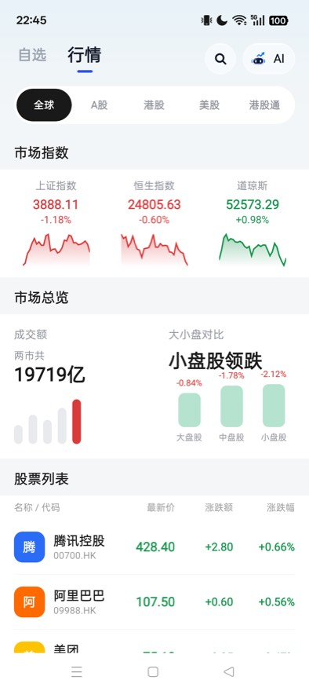 | 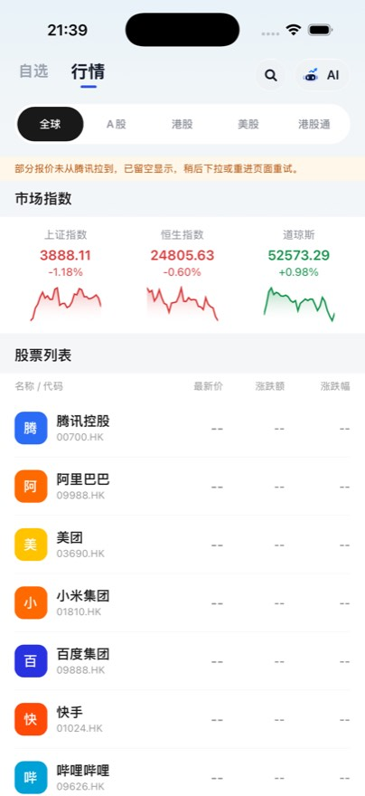 | 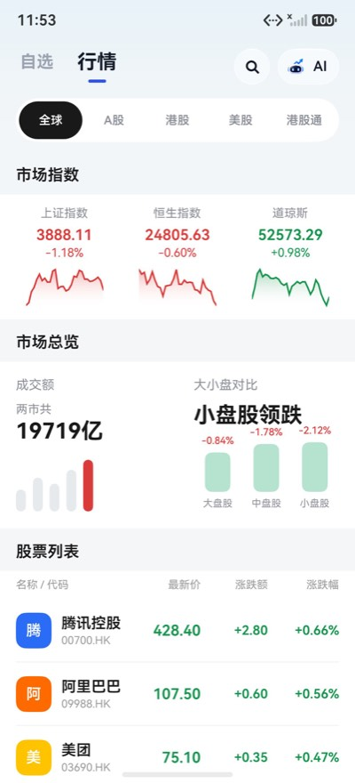 |

### 自选页

| Android | iOS | 鸿蒙 |
| :---: | :---: | :---: |
| 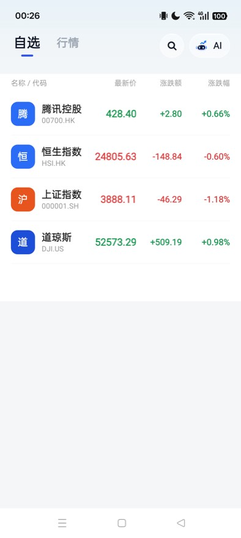 | 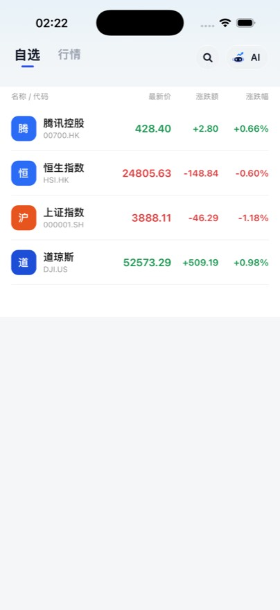 | 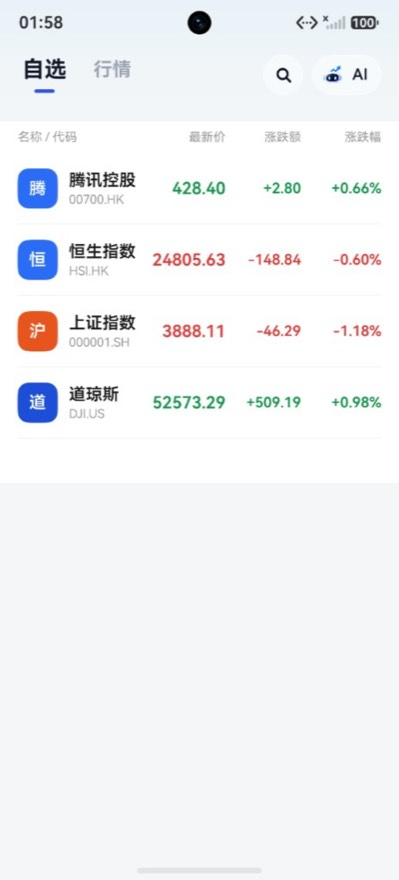 |

### AI 问答页

| Android | iOS | 鸿蒙 |
| :---: | :---: | :---: |
|  | 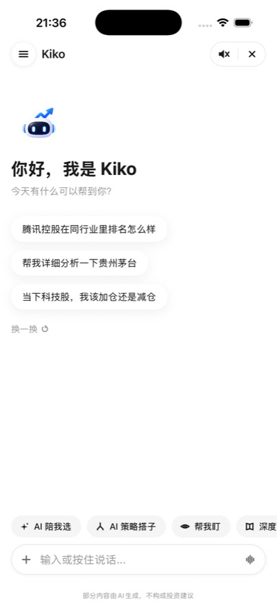 | 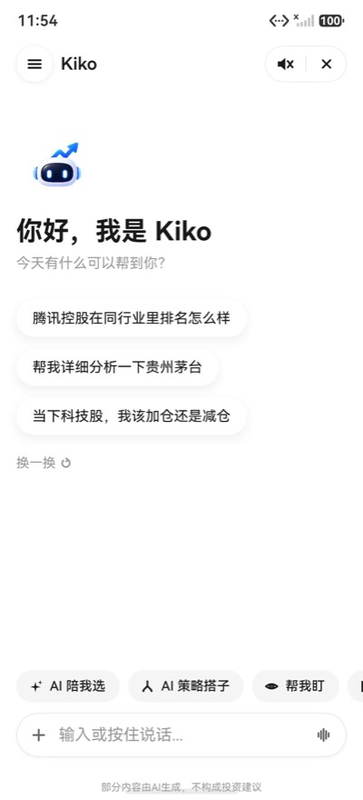 |

### 个股详情页

| Android | iOS | 鸿蒙 |
| :---: | :---: | :---: |
| 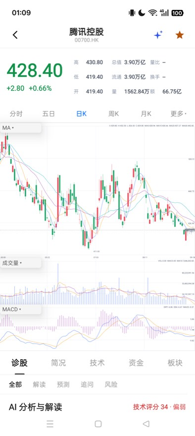 | 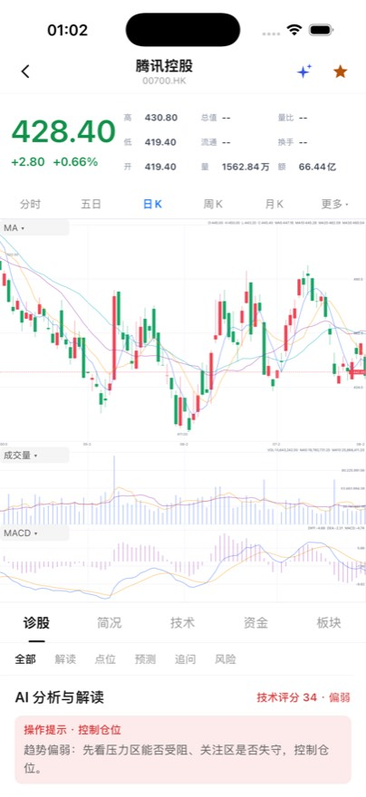 | 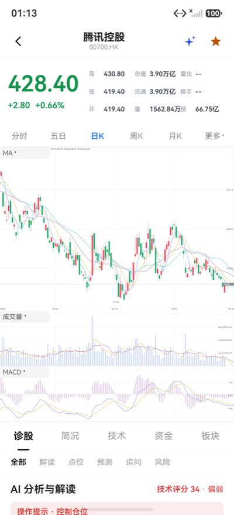 |

### 视频

[kiko-demo.mp4](docs/kiko-demo.mp4)

三端行情 → 个股 → AI 问答走查。点开仓库内视频即可在 GitHub 文件页播放。

### Android 安装包

[kiko-android.apk](docs/kiko-android.apk)

Android 8.0+ 真机可直接安装（debug 签名）。首次安装需允许「未知来源」。下载后点开即可体验行情与 AI 问答。

## 项目简介

用户可以按市场浏览真实行情、点进个股看 K 线工作区，也可以直接问 AI 排名、对比或仓位观察。本地用行情快照和技术分析拼出可核对的数字卡片，模型只写章节解读，再按「标题 → 文字 → 数据卡」穿插成一篇回答。点卡片进详情，详情十字光标选点也能带回聊天。

### 技术栈

- **客户端**：Kotlin、Kotlin Multiplatform、Kuikly Compose DSL
- **平台端**：Android、iOS、OpenHarmony
- **网络与数据**：Kuikly `NetworkModule`、腾讯 `qt` / `fqkline`
- **AI**：阿里云百炼（对话、文档、语音）；密钥放在本地 `AiSecrets.kt`
- **图表**：共享 K 线工作区 + 各端原生图桥
- **工程化**：Gradle Kotlin DSL、`:components` 与 `:shared` 拆仓

## 完成任务情况

| 课题 | 状态 | 交付 |
| --- | --- | --- |
| **Task 1 · AI 行情原型** | 已完成 | 行情首页、分市场切换、指数与总览、自选、个股详情与完整 K 线工作区 |
| **Task 2 · AI 股票问答** | 已完成 | 研究过程可见、结论+证据卡片、流式正文、附件/语音、详情选点追问 |

### Task 1

- **行情列表**：名称、代码、最新价、涨跌额、涨跌幅；可滚、可搜、可点进详情。
- **七个市场**：全球 / 自选 / 指数 / A股 / 港股 / 港股通 / 美股；各 Tab 有对应指数 sparkline。
- **市场总览**：A 股与全球展示两市成交额和大小盘（沪深300 / 中证500 / 中证1000）；港股、港股通展示恒指成交额与恒指/恒科/国企；美股不硬凑两市数据。
- **真实行情**：腾讯 `qt` / `fqkline`。缺数显示 `--` 并提示不完整，**不用 Mock 价冒充实时**。
- **个股详情**：分时 / 五日 / 日周月 K，以及分钟与季年等扩展周期；一主图二副图（均线、成交量、MACD 等）。
- **页内承接**：诊股、简况、技术、资金、板块，避免一屏堆到底。
- **图表进聊天**：十字光标选中某根 K 线，带着时间与价格去问 AI。

### Task 2

- **真研究阶段**：理解问题 → 识别标的 → 读行情/日 K → 交叉分析 → 完成。阶段由请求推进，不是假倒计时；正文出来后进度条收起，来源可再展开。
- **结论先行、证据随后**：本地用真实行情拼卡片/图表，模型只写章节解读，再按「标题 → 文字 → 数据卡」穿插。
- **结构化回答**：行情卡、同行表、对比、K 线/柱状/多序列图、关键价位、风险与追问；点卡片进详情。
- **同业问答**：先给格局结论，再给可点进详情的对比表和阶段表现。
- **多模态**：图片、文档（`qwen-long`）、语音输入与朗读。
- **收束操作**：朗读、赞踩、系统分享、重新生成；失败可重试，不把错误伪装成分析。

## 快速开始

### 1. 环境

- JDK 17+；鸿蒙链路需 JDK 21（在 `~/.gradle/gradle.properties` 配 `org.gradle.java.home`，勿写进仓库，见 `gradle.properties` 注释）
- Android Studio（Android 端）
- Xcode + CocoaPods（iOS 端）
- DevEco Studio（鸿蒙端）

### 2. 配置密钥

```bash
cp shared/src/commonMain/kotlin/com/kuikly/stockchat/data/ai/AiSecrets.kt.example \
   shared/src/commonMain/kotlin/com/kuikly/stockchat/data/ai/AiSecrets.kt
# 填写百炼 API_KEY；语音 / iTick 可空
```

密钥不要提交。`sk-sp-` 走 Token Plan，其余走 DashScope。

可选：`python scripts/ak_gateway.py`（`127.0.0.1:8790`）后才有连板 / 广度 / 资金卡。

### 3. 运行客户端

**Android**：

```bash
./gradlew :androidApp:assembleDebug
adb install -r androidApp/build/outputs/apk/debug/androidApp-debug.apk
```

直达聊天：

```bash
adb shell am start -n com.kuikly.stockchat/com.kuikly.stockchat.android.KuiklyRenderActivity --es pageName StockChat
```

**iOS**：

```bash
./gradlew :shared:podInstall
(cd iosApp && pod install)
xcodebuild -workspace iosApp/KuiklyStockChat.xcworkspace -scheme KuiklyStockChat \
  -configuration Debug -sdk iphonesimulator ARCHS=arm64 ONLY_ACTIVE_ARCH=YES build
# 产物在 DerivedData 的 Debug-iphonesimulator/KuiklyStockChat.app，根页已是 MarketList
```

**鸿蒙**：`kuikly-ohos-compile-plugin` 自动编译存在任务名问题，当前走手动链路（`hvigorfile.ts` 未挂该插件，无需额外关闭）：

```bash
# 1) 编译 KMP 共享层，产出 libshared.so（此链路需 JDK 21，
#    建议在 ~/.gradle/gradle.properties 配 org.gradle.java.home）
./gradlew -c settings.ohos.gradle.kts :shared:linkDebugSharedOhosArm64

# 2) 拷贝产物到鸿蒙工程
cp shared/build/bin/ohosArm64/debugShared/libshared.so ohosApp/entry/libs/arm64-v8a/
cp shared/build/bin/ohosArm64/debugShared/libshared_api.h ohosApp/entry/src/main/cpp/include/

# 3) 打 HAP（DevEco 自带 ohpm / hvigorw）
cd ohosApp
/Applications/DevEco-Studio.app/Contents/tools/ohpm/bin/ohpm install
DEVECO_SDK_HOME=/Applications/DevEco-Studio.app/Contents/sdk \
  /Applications/DevEco-Studio.app/Contents/tools/hvigor/bin/hvigorw assembleHap --no-daemon
```

### 4. 构建产物与安装

| 平台 | 产物 | 体积 | 安装与启动 |
| --- | --- | --- | --- |
| Android | `androidApp/build/outputs/apk/debug/androidApp-debug.apk` | ≈10 MB | `adb install -r <apk>`；`am start -n com.kuikly.stockchat/com.kuikly.stockchat.android.KuiklyRenderActivity` |
| iOS（模拟器） | `Debug-iphonesimulator/KuiklyStockChat.app` | ≈32 MB | `xcrun simctl install <udid> <app>`；`xcrun simctl launch <udid> com.kuikly.stockchat` |
| 鸿蒙 | `ohosApp/entry/build/default/outputs/default/entry-default-unsigned.hap` | ≈22 MB | `hdc install <hap>`；`hdc shell aa start -a EntryAbility -b com.kuikly.stockchat` |

> 鸿蒙产物为 unsigned HAP，模拟器可直接安装；真机需在 DevEco Studio 配置签名证书。iOS 真机需自行配置签名后按 `iphoneos` SDK 出包。免构建体验可直接装 [docs/kiko-android.apk](docs/kiko-android.apk)（已预置评审配置）。

## 架构说明

项目采用「共享页面与领域逻辑 + 各端宿主桥」：

```text
kuikly-stock-chat/
├── shared/                 # 跨端页面、问答、行情、分析与卡片
├── components/             # 图表 / 表格 / Markdown，无 @Page
├── androidApp/             # Android 容器与原生模块
├── iosApp/                 # iOS 容器、K 线与画布适配
├── ohosApp/                # 鸿蒙工程与原生 View / Module
├── buildSrc/               # Gradle 依赖与版本
└── docs/                   # 演示视频等说明资产
```

- `shared/.../app`：`MarketList`、`StockDetail`、`StockChat`、`StockChatSettings` 四个 `@Page`。
- `shared/.../ui/market`：行情首页与市场总览。
- `shared/.../ui/detail`：个股工作区、诊股与分栏。
- `shared/.../ui/chat`、`ui/answer`：问答壳与结构化卡片。
- `shared/.../domain`：意图、研报拼装、技术分析。
- `shared/.../data`：腾讯行情、百炼、附件与会话存储。

平台工程只做容器、资源目录和附件 / 分享 / 语音 / K 线图桥，不复制业务页。

## 设计亮点

### 模块化设计

按页面 / 组件 / 数据 / 共享代码四层拆开，共享层占主导：四个 `@Page` 和领域逻辑都在 `commonMain`，Android / iOS / 鸿蒙宿主只注册原生桥，不复制业务页。

| 层 | 实际落点 |
| --- | --- |
| 页面 | `shared/.../app`：`MarketList`、`StockDetail`、`StockChat`、`StockChatSettings` |
| 组件 | `:components` 图表 / 表格 / Markdown；`shared/.../ui` 行情、详情、问答卡片 |
| 数据 | `shared/.../data`：行情解析、百炼、附件与会话存储 |
| 共享代码 | `shared/.../domain` 意图、研报拼装、技术分析；三端同一套 Kotlin |

### 接入真实行情 API

列表报价和日 K 走腾讯财经（`web.sqt.gtimg.cn` 实时行情、`web.ifzq.gtimg.cn` `fqkline` / `minute`）。详情分时优先 iTick 分钟 K，失败再回退腾讯分时。连板 / 广度 / 资金只在本地 AKShare 网关有数时出现。缺数显示 `--` 并提示不完整，首页不用 Mock 价冒充实时。

### 卡片是证据，模型是文案

`AnswerComposer` 用快照和技术分析出可复现数字；百炼按章节写解读；`AnswerAssembler` 把两段缝成一篇研报。Key 缺失或模型失败直接说原因，不换套话。

AI 回复不只落 Markdown：同一条回答按业务穿插行情卡、同行表、分组柱、相对走势折线、技术分仪表盘、日 K 与涨跌柱。模型写解读，结构化块用真实行情画，点卡片还能进详情。

| 阶段表现分组柱状图 | 相对走势折线图 | 技术评分仪表盘与日 K |
| :---: | :---: | :---: |
| 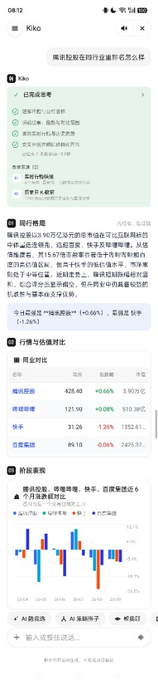 | 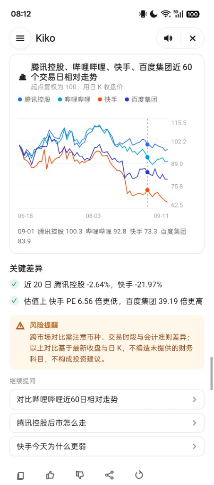 | 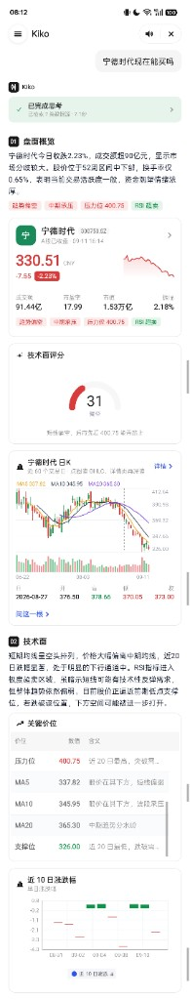 |

### 动画打磨

欢迎页、抽屉、语音都按手势走过渡，不硬切。点输入框时欢迎语和推荐问一起收起、输入条展开；侧栏跟手并带回弹；按住说话升起波形，松开发送 / 左滑取消 / 右滑编辑。

| 输入框与欢迎语联动 | 抽屉栏 | 语音输入 |
| :---: | :---: | :---: |
| 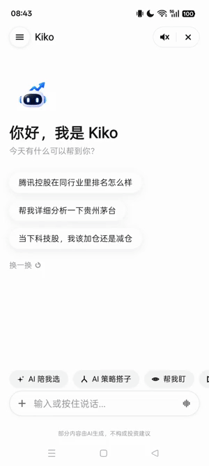 |  |  |

### 研究过程可核对

进度和「用了几类数据源、几个标的、多少根日 K」来自本轮真实调用，不是假倒计时，也不伪造网页检索条数。

### 图表和对话打通

详情十字光标选点 → 带 OHLC 进聊天；回答里的行情卡 / 同行表再点回详情。

### K 线是工作区不是贴图

多周期、主图 + 双副图、指标切换。日 K 预测只在模型校验通过后叠加，失败不画假曲线。美股指数报价走 `usDJI`，K 线走 `us.DJI`，避免腾讯单根棒。

### 组件与业务拆仓

`:components` 无 `@Page`，图表 / 表格 / Markdown 独立，避免 KSP 入口冲突。Task 1 与 Task 2 在同一仓库交付，行情与卡片数字可回溯到接口。

### 通用组件库孵化

问答和详情里用到的可视化，按能力拆成可复用仓库，不绑死股票业务。本仓库继续做场景，组件库单独演进。

| 组件 | 仓库 |
| --- | --- |
| K 线图 | [KuiklyKLineChart](https://github.com/qingfeng19491001/KuiklyKLineChart) |
| 图表 | [KuiklyChart](https://github.com/qingfeng19491001/KuiklyChart) |
| 表格 | [KuiklyTableView](https://github.com/qingfeng19491001/KuiklyTableView) |

## 开发与测试

```bash
./gradlew :shared:testDebugUnitTest
```

## 免责声明

项目用于学习、跨端实践与课题演示。AI 解读与行情数据可能延迟或失败，**不构成投资建议**。Kuikly、百炼、腾讯行情各自遵循其条款。
